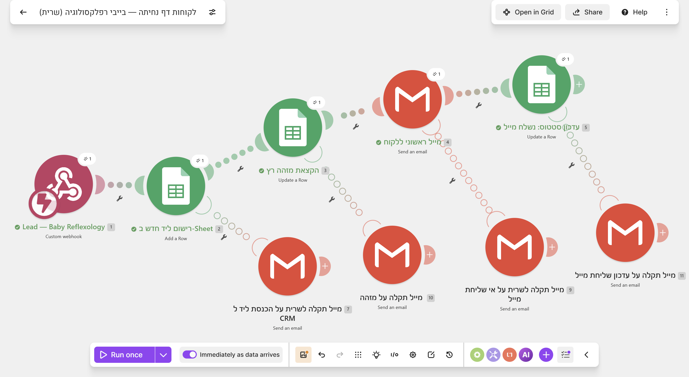
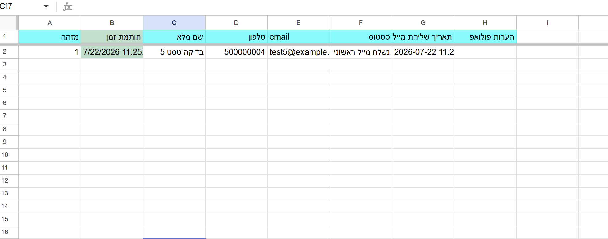
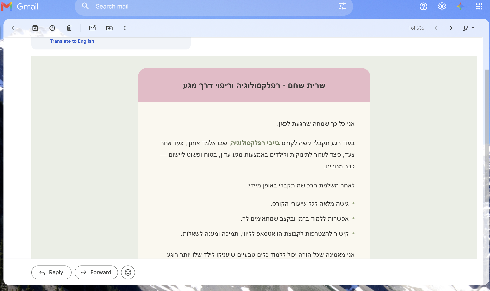
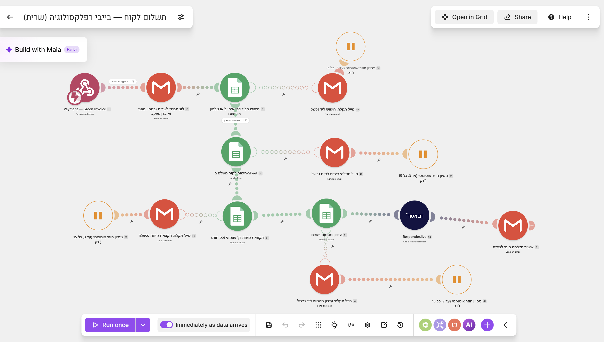

# Baby Reflexology — lead & payment automation

Two Make.com automations built for a real small business: a course landing page ([babyreflexology.co.il](https://babyreflexology.co.il)) that captures every signup, and a payment flow that grants course access the moment a real payment lands — no manual copy-paste, no missed follow-up.

This repo documents the automation piece of a larger project, published with the client's permission as a portfolio case study. It's not a runnable app and it holds no automation source (blueprints/configs) — Make.com is the only source of truth for the live scenarios. This repo shows *what* the system does and *why* it's built that way, backed by screenshots of it running for real, plus the actual email template sent to leads.

---

## About the project

The client is a reflexologist running a private clinic (pregnancy, fertility issues, migraines) who also teaches a course called *Baby Reflexology* — hands-on techniques parents can use on infants for common first-year issues (colic, constipation, sleep). She needed a way to sell and deliver that course online, end to end, with no existing website or digital sales process.

**Built solo, end to end**, beyond just these two automations:

- **The landing page itself** — business spec → copy → visual design → build in Lovable, deployed on the client's own domain (babyreflexology.co.il). It's a separate app under the client's own account/repo, not part of this repo.
- **Accessibility** — audited in a real browser (not a checklist pass), including a floating accessibility widget (text size, contrast, link emphasis, motion toggle) matching the standard pattern used on Israeli sites. Live Lighthouse scores: 96 accessibility, 100 Best Practices, 100 SEO.
- **AEO/GEO for AI search** — structured data (JSON-LD) and an `llms.txt` file, so AI-driven search/answer engines can parse the business correctly.
- **Privacy policy + terms of use** — drafted from what the site actually does (verified in the code, not assumed), not boilerplate.
- **Payment infrastructure** — Green Invoice (billing/receipts) connected to Morning and Grow for the actual charge.
- **The two automations below** — the backend that ties the form, the CRM, and the payment webhook together.

## The automations

### 1. Lead capture

**The problem:** every landing-page signup needed to be captured reliably and followed up on immediately, without the client manually checking a form/email inbox all day.

**The flow:**

```
Landing page form ──▶ Webhook ──▶ Google Sheets (CRM row) ──▶ Gmail (instant reply) ──▶ Google Sheets (status update)
```

- **Webhook-triggered**, so the landing page (built separately in Lovable) just POSTs `{name, phone, email}` — no polling delay.
- **Google Sheets as the CRM** — a single spreadsheet the client already knew how to use, no new tool to learn. Each lead gets a running ID and a status column (`ליד חדש` → `נשלח מייל ראשוני` → …).
- **Immediate branded email reply**, so the lead hears back in seconds, not whenever the client next checks her phone.
- **Status write happens *after* the email send, not before** — if the email fails, the row stays visibly at "not yet emailed" instead of silently reporting success.
- **Every step has an error-alert branch** (visible in the screenshot below) — a failure emails the owner immediately instead of disappearing silently.

Full diagram: [`docs/diagrams/flow.md`](docs/diagrams/flow.md).

**Screenshots (live, real data — not mockups):**

The Make.com scenario, running:



A lead row written to the Sheet:



The email as actually received in Gmail:



The actual HTML email template sent to every lead lives in [`templates/email-initial-lead.html`](templates/email-initial-lead.html) (one embedded personal/branding image redacted — see the file for why).

---

### 2. Payment → course access

**The problem:** once a client pays (via Green Invoice), she needs course access granted automatically and reliably — matched back to the right lead, with no risk of a payment silently going untracked.

**The flow (high level):**

```
Green Invoice webhook ──▶ filter (course price only) ──▶ match to existing lead (by email or phone)
   ──▶ record paying customer ──▶ mark lead as paid ──▶ grant course access ──▶ confirm to owner
```

- **Filtered at the door**: only receipts at the course's actual price trigger anything — unrelated payments (e.g. in-clinic sessions) are ignored.
- **Matched by email *or* phone**, not email alone — a customer who pays with a different email than the one she signed up with (but the same phone) still gets matched correctly.
- **Every step is wrapped in retry + alert**: up to 3 automatic retries (15 minutes apart) before anything requires manual attention, and a specific email to the owner naming exactly which step failed and what to do about it.
- **A standing safety-net log** fires the moment a qualifying payment arrives — before any matching/writing happens — so even a total downstream failure still leaves a trace.
- **Course access itself isn't sent by Make** — this was rebuilt after testing showed the original design (a static email with a hardcoded course-link placeholder) didn't match how the course platform actually works. The live version instead adds the customer to a mailing-list-based subscriber system that's integrated with the course platform, which is what actually triggers access + login delivery.
- **A final confirmation email to the owner** closes the loop — if it arrives, nothing about that payment needs manual checking.

**Screenshot (live scenario, including the retry/alert branches on every step):**



---

## Repo layout

```
templates/    ← the actual HTML email sent to leads (one embedded image redacted — see the file)
docs/         ← flow diagram + screenshots
```

No automation source (Make blueprints/configs) is published here — only screenshots, the rendered email template, and a written description of the logic. That's a deliberate choice, not an oversight: the actual scenario configuration stays private to the client's account.

## What's redacted, and why

This documents a live client system, not a demo:

- No Make.com blueprint/config JSON is included, for either automation — only screenshots and narrative description of the logic.
- A ~40KB base64-embedded personal/branding image in the email template → a one-line comment. The template renders correctly without it; the image itself just wasn't necessary to show the automation.

## Tech

Make.com (scenarios/webhooks), Google Sheets (CRM), Gmail (transactional email), Green Invoice (payment webhook). The landing page itself is a separate Lovable/React app, not part of this repo.
