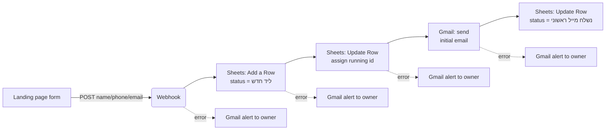

# Flow diagram — lead intake

Main path (green in the live scenario) plus the error-handling branches (red) visible in [`docs/screenshots/make-scenario.png`](../screenshots/make-scenario.png) — each step on the main path has a Gmail alert wired to its error output, so a failure surfaces immediately instead of silently dropping a lead.

**Why the status update (step F) comes after the email (step E), not before:** if the email send fails, the row must stay at "ליד חדש" so the failure is visible in the sheet itself, not just in an alert email — see [`../../automation/make-blueprint-leads.json`](../../automation/make-blueprint-leads.json).
